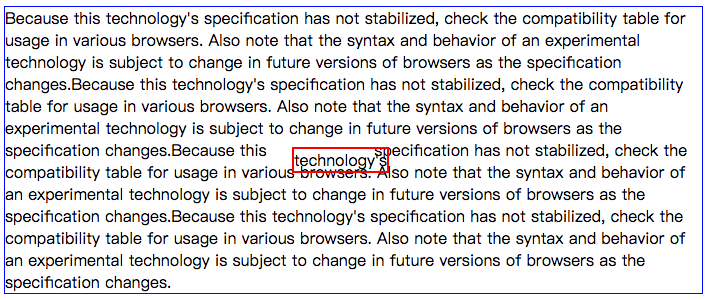
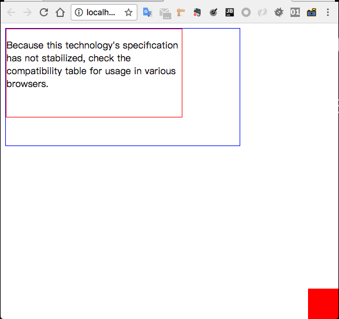
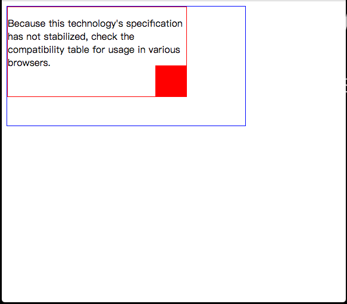
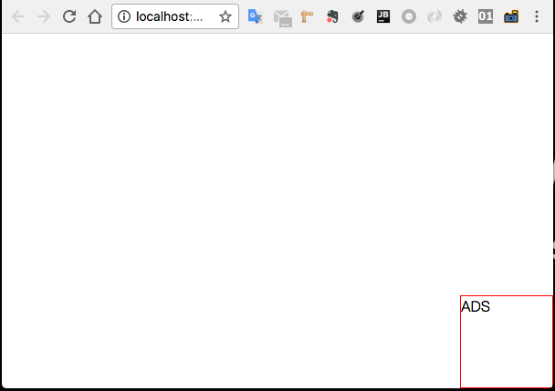

## 定位

> `position` 属性指定元素的定位类型(静态，相对，固定或绝对).

### `positon` 属性

* `position` 属性指定元素的定位类型
* 一共有四种定位值
    * `static` (静态)
    * `relative` (相对)
    * `absolute` (绝对)
    * `fixed` (固定)

    
* 然后使用`top` `bottom` `left` `right` 属性定位元素。
* 但是，除非首先设置 `position` 属性，否则上述四个属性将不起作用。它们的工作方式也取决于`position`值。

### `position: static;`
* 默认情况下，HTML元素的定位值是 `static`
* 静态定位的元素不受 `top` `bottom` `left` `right` 属性的影响。
* 一个元素设置了 `position：static;` 该元素没有任何特殊的布局: 它总是按照页面的正常流进行定位

    
### `position: relative;`
* 相对定位是元素相对于其本身在正常流布局中的位置定位。
* 设置相对定位的元素的`top` `right` `bottom` `left`属性将使其被调整远离其在正常的位置。其他内容不会被调整以适应元素留下的任何空白。



CSS代码:
```css
        span {
            border: 2px solid red;

            position: relative;
            left: 20px;
            top: 10px;
        }

```

可以看到technology's所在的span元素设置相对定位之后, `top`值是相对其在正常流位置距上边10px, `left` 值是相对其在正常流位置距左边10px.

同时technology's所在的原位置是空白, 后面的内容并没有填充进去.


### `position: absolute;`
* 绝对定位是相对于离其本身最近的定位值为非`static`的元素(`position` 值为: `absolut` `relative`, `fixed`其中一个).
* 如果绝对定位元素没有找到定位值为非 `static` 的元素, 则相对于当前的页面.

初始页面:
 


需求: 将中间的红色块定位在红色框的右下角

CSS修改如下:
```css
        .in {
            width: 50px;
            height: 50px;
            background-color: red;

            position: absolute;
            right: 0;
            bottom: 0;
        }
```

结果如下:



会发现红色块定位在了页面中右下角, 因为红色框和蓝色框的元素定位值没有设置(默认值为 `static` ), 因此红色块就会以当前页面为包含块.

修改CSS如下:
```css
        .middle {
            width: 300px;
            height: 150px;
            overflow: hidden;

            position: relative;
        }

        .in {
            width: 50px;
            height: 50px;
            background-color: red;

            position: absolute;
            right: 0;
            bottom: 0;
        }
```

效果如下: 



将红色框的定位设置为 `relative` 之后, 红色块将以红色框为包含块进行定位. 同时红色块后面的内容将填充红色块正常流中的位置(绝对元素将从正常流中抽离出来).


### `position: fixed;`
* 固定定位的元素相对于视口定位，这意味着它始终保持在相同的位置，即使页面滚动。`top` `right` `bottom` `left` 属性用于定位元素位置。

* 一个固定元素不会在页面中留出其在正常流中的位置(固定元素将从正常流中分离出来).



CSS代码:
```css
        p {
            border: 1px solid red;
            width: 100px;
            height: 100px;

            position: fixed;
            right: 0;
            bottom: 0;
        }
```


