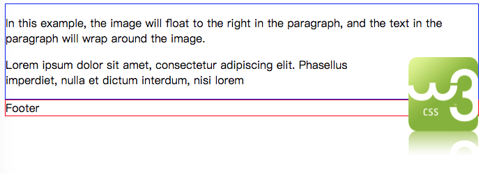
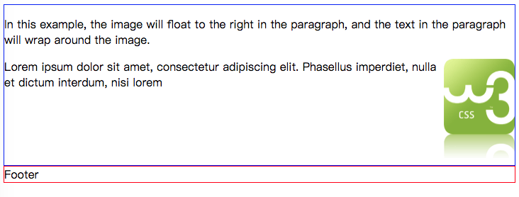

## 文字绕流浮动布局带来的问题

CSS代码部分
```css
        img {
            float: right;
            margin: 0 0 10px 10px;
        }

        div.content {
            border: 1px solid blue;
        }

        div.footer {
            border: 1px solid red;
        }
```

效果如下:




此时如果文本不多, 不能超过图片下边距的时候, 下面的footer内容元素会紧贴在content下面. 而我们希望footer的div是在图片的下边.此时可以通过修改CSS属性值解决.

修改后的CSS代码:
```css
        img {
            float: right;
            margin: 0 0 10px 10px;
        }

        div.content {
            border: 1px solid blue;

            /* 设置溢出属性 */
            overflow: auto;
        }

        div.footer {
            border: 1px solid red;
        }
``` 

修改后效果如下:


