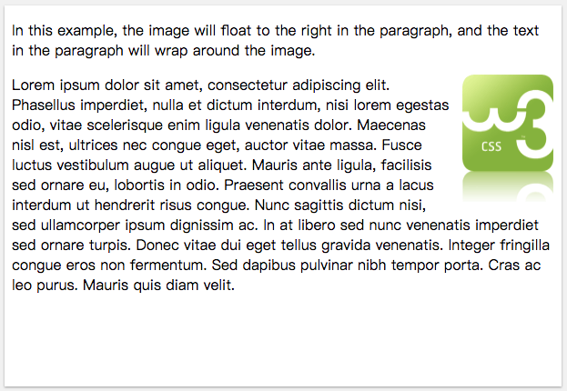
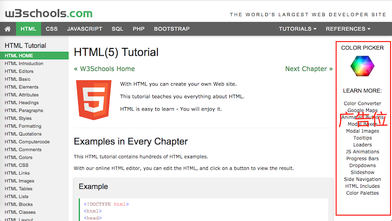

## 浮动
> 浮动布局是网页布局中最常用的布局之一
>
> 浮动布局同时也会带来一些布局问题, 常用有4种解决方案

## 浮动原理
* 一个元素设置 `float` 属性值为 `left` 或 `right` 时, 该元素从网页的正常文档流中移除(好像此元素不存在)进入浮动流中. 
* 文档流下面的元素正常布局. 
* 当文档流布局完成之后, 浮动流再布局
* 浮动元素沿父元素容器的左侧或右侧放置

### 浮动布局场景一
* 文字绕流 

### 浮动布局场景二
* 网页头部的导航栏

### 浮动布局场景三
* 网页的商品展示(水平方向排列)

### 浮动布局场景四
* 网页右边的广告位

