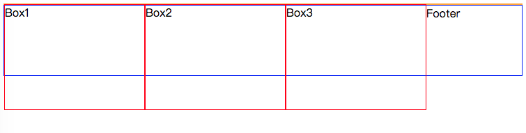
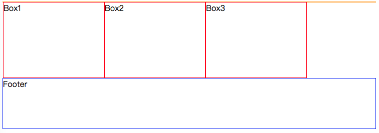

## 清除浮动方案二

CSS代码
```css
        .content {
            border: 1px solid orange;
        }

        .box1, .box2, .box3 {
            border: 1px solid red;
            width: 200px;
            height: 150px;
            float: left;
        }

        .footer {
            border: 1px solid blue;
            height: 100px;
        }
```

效果如下: 




上面的效果会发现因为 div1~div3 设置了浮动导致footer的div元素在最上面, 解决思路是清除浮动.

修改后的CSS代码:
```css
        .content {
            border: 1px solid orange;
        }

        .box1, .box2, .box3 {
            border: 1px solid red;
            width: 200px;
            height: 150px;
            float: left;
        }

        .footer {
            border: 1px solid blue;
            height: 100px;

            /* 清除浮动 */
            clear: both;
        }
```  

效果如下: 


