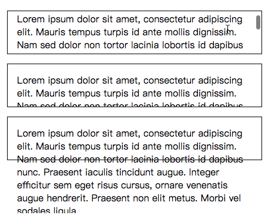

# 盒模型 (Box Model)


>* 什么是盒模型
>* `content` `padding` `border` `margin` 属性
>* 外边距塌陷(margin collapsing)
>* `width` `heigh` 属性
>* 盒子总宽度和总高度计算
>* `box-sizing` 属性
>* `overflow` 属性
>* `background-clip` 属性
>* `outline` 属性


盒模型是网页布局的基础

在CSS中, 每个元素被表示(看做)为一个矩形的盒子

盒子从内到外分别由 `content`(内容区) `padding`(内边距) `border`(边框) `margin`(外边距) 组成


## Box 属性
#### `width` 和 `height`: 
`width` 和 `height` 设置内容区(content box)的宽度和高度. 内容盒是盒子内容显示的区域--包括盒子内的文本内容, 以及表示嵌套子元素的其它盒子.


#### `padding`:
padding 表示一个CSS盒子的内边距--这一层位于内容盒的外边缘与边框的内边缘之间. 该层的大小可以通过简写属性 `padding` 一次设置所有四个边, 或用 `padding-top` `padding-right` `padding-bottom` 和 `padding-left` 属性一次设置一个边.


#### `border`:
CSS盒的边框(border)是一个分隔层, 位于内边距的外边缘以及外边距的内边缘之间. 边框的默认大小为0--从而让它不可见--不过我们可以设置边框的宽度, 样式和颜色让它出现. `border` 简写属性可以让我们一次设置所有四个边, 例如: `broder: 1px solid black;` 但这个简写可以被各种普通书写的更详细的属性所覆盖:

* `border-top` `border-right` `border-bottom` `border-left`: 分别设置某一边框的宽度,样式,颜色.

* `border-width` `border-style` `border-color`: 分别仅设置边框的宽度,风格,颜色, 并应用到全部四边边框.

* 你也可以单独设置某一个边的三个不同属性, 如 `border-top-width`, `border-top-style`, `border-top-color` 等. 

#### `margin`:
外边距(margin)代表CSS盒子周围的外部区域, 在布局中推开其它CSS盒子. 其表现与padding很相似. 简写属性 `margin`, 单个属性分别为 `margin-top` `margin-right` `margin-bottom` `margin-left`


> 注意: 外边距有一个特别的行为被称作[外边距塌陷(margin collapsing)](../外边距塌陷/README.md): 当两个盒子彼此接触时, 他们的间距将取两个相邻外边距框的最大值, 而非两者的总和.


## 盒子总宽度和总高度
盒子的总宽度是 `width`+`padding-right`+`padding-left`+`border-right`+`border-left`+`margin-right`+`margin-left`之和(总高度同理). 但这样设置和计算盒子的宽度和高度比较麻烦. 可以使用 `box-sizing` 来调整盒子模型, 使用 `box-sizing: border-box`, 它将盒子模型更改成新的模型:


## Box其他常用属性

#### `overflow`
当你使用绝对值设置了一个盒子的大小(如固定像素的宽/高), 而此大小可能不适合放置内容,这种情况下内容会从盒子溢出. 我们使用 `overflow` 属性来控制这种情况的发生. 它有一些可能的值, 但是最常用的是:
* `auto`: 当内容过多, 溢出的内容被隐藏, 然后出现滚动条来让我们滚动查看所有的内容.
* `hidden`: 当内容过多, 溢出的内容被隐藏.
* `visible`: 当内容过多, 溢出的内容被显示在盒子的外边(这是默认行为)

该示例展示了这些设置是如何工作的:
HTML代码:
```html
<p class="autoscroll">
   Lorem ipsum dolor sit amet, consectetur adipiscing elit.
   Mauris tempus turpis id ante mollis dignissim. Nam sed
   dolor non tortor lacinia lobortis id dapibus nunc. Praesent
   iaculis tincidunt augue. Integer efficitur sem eget risus
   cursus, ornare venenatis augue hendrerit. Praesent non elit
   metus. Morbi vel sodales ligula.
</p>

<p class="clipped">
   Lorem ipsum dolor sit amet, consectetur adipiscing elit.
   Mauris tempus turpis id ante mollis dignissim. Nam sed
   dolor non tortor lacinia lobortis id dapibus nunc. Praesent
   iaculis tincidunt augue. Integer efficitur sem eget risus
   cursus, ornare venenatis augue hendrerit. Praesent non elit
   metus. Morbi vel sodales ligula.
</p>

<p class="default">
   Lorem ipsum dolor sit amet, consectetur adipiscing elit.
   Mauris tempus turpis id ante mollis dignissim. Nam sed
   dolor non tortor lacinia lobortis id dapibus nunc. Praesent
   iaculis tincidunt augue. Integer efficitur sem eget risus
   cursus, ornare venenatis augue hendrerit. Praesent non elit
   metus. Morbi vel sodales ligula.
</p>
``` 

应用到HTML的CSS代码:
```css
p {
  width  : 400px;
  height : 2.5em;
  padding: 1em 1em 1em 1em;
  border : 1px solid black;
}

.autoscroll { overflow: auto;    }
.clipped    { overflow: hidden;  }
.default    { overflow: visible; }
```

上面的代码显示如下效果: 



#### `background-clip` 
盒子的背景是由颜色和图片组成的. 它们堆叠在一起(`background-color` `background-image`). 它们被应用到一个盒子里, 然后被画在盒子的下面. 默认情况下, 背景延伸到了边框外边. 但有的时候你只想要它延伸到内容边界, 这可以通过设置盒子的 `background-clip` 属性来调整.

示例的HTML代码:
```html
<div class="default"></div>
<div class="padding-box"></div>
<div class="content-box"></div>
```

CSS代码:
```css
div {
  width  : 60px;
  height : 60px;
  border : 20px solid rgba(0, 0, 0, 0.5);
  padding: 20px;
  margin : 20px 0;

  background-size    : 140px;
  background-position: center;
  background-image   : url('https://mdn.mozillademos.org/files/11947/ff-logo.png');
  background-color   : gold;
}

.default     { background-clip: border-box;  }
.padding-box { background-clip: padding-box; }
.content-box { background-clip: content-box; }
```

效果如下:


#### `outline`
最后, 还有重要的一点, 一个盒子的outline是一个看起来像border但又不属于盒模型的东西. 它的行为和盒子边框差不多, 但是并不改变盒子的尺寸(更准确的说, outline是画在border外面, 外边距里面的)

outline和border在以下不同:
* outline不占据空间
* outline可以是非矩形的. 在Gecko/Firefox中, outline是矩形的, 但是在Opera则会围绕元素结构绘制非矩形的形状.

> Note: 使用outline属性的时候要注意, 它一般只在需要可用性的一些情况下被使用, 例如在一些用户点击它的时候使用outline来表示高亮, 可用. 如果你要使用outline, 请确保不要因为它看起来像链接的高亮让用户迷惑
