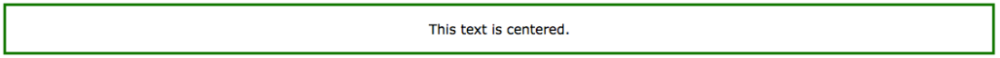
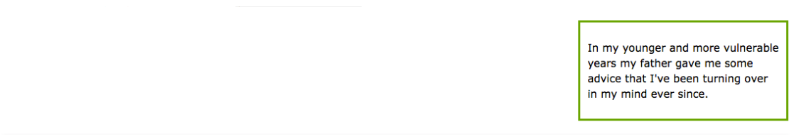
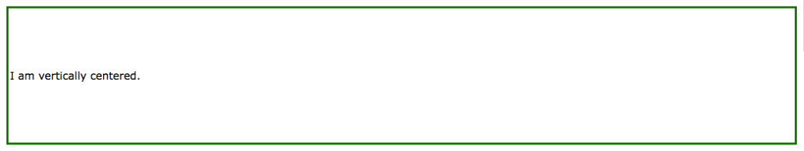
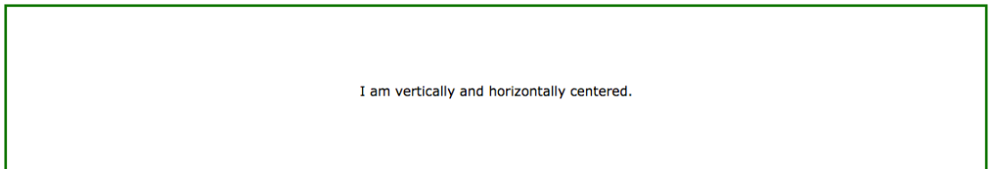

## 页面中常用的对齐布局

### 块元素水平居中
* 要使块元素（如`<div>`）水平居中，可以使用 `margin：auto;`
* 设置元素的宽度将防止其延伸到其容器的边缘。
* 然后元素将占据指定的宽度，剩余空间将在两个边距之间平均分配

CSS代码:
```css
.center {
    margin: auto;
    width: 50%;
    border: 3px solid green;
    padding: 10px;
}
```
> 如果 width 属性未设置（或设置为100％），则中心对齐无效。

### 文本水平居中
* 要使元素中的文本居中，可以使用 `text-align：center;`


CSS代码
```css
.center {
    text-align: center;
    border: 3px solid green;
}
```

### 图像水平居中
* 要使图像居中，可以使用 `margin：auto;` 并使其成为块元素


CSS代码:
```css
img {
    display: block;
    margin: auto;
    width: 40%;
}
```


### 使用 `position` 使用左右对齐元素
* 一种用于对齐元素的方法是使用 `position：absolute ;`


CSS 代码:
```css
.right {
    position: absolute;
    right: 0px;
    width: 300px;
    border: 3px solid #73AD21;
    padding: 10px;
}
```
> 注意：绝对定位元素从正常流中删除，并可以重叠元素。
>
> 提示：当使用 position 将元素对齐时，始终为 `<body>` 元素定义 `padding` 和 `margin`。这是为了避免不同浏览器的视觉差异。
>
> 使用 position 时，IE8和更早版本也有问题。如果一个容器元素（在我们的例子中：`<div class =“container”>`）有一个指定的宽度，`!DOCTYPE` 声明缺失，IE8和早期版本会在右侧添加一个17px的边距，这似乎是为滚动条保留的空间。所以，使用 `position` 时，总是设置 `!DOCTYPE` 声明


### 使用 `float` 对齐元素
* 另一种对齐元素的方法是使用 `float` 属性

CSS代码:
```css

body {
    margin: 0;
    padding: 0;
}

.right {
    float: right;
    width: 300px;
    border: 3px solid #73AD21;
    padding: 10px;
}
```

> 提示：当使用 `float` 将元素对齐时，始终为 `<body>` 元素定义 `padding` 和 `margin`。这是为了避免不同浏览器的视觉差异。
>
> 当使用 `float` 时对于IE8和更早期版本也会有一个问题，如果 `!DOCTYPE` 声明缺失，IE8和早期版本将在右侧添加一个17px的边距。这似乎是为滚动条保留的空间。因此，使用 `float` 时，始终设置 `!DOCTYPE` 声明：
>


### 使用 `padding` 实现垂直居中
* 有许多方法在CSS中可以垂直居中元素。一个简单的解决方案是设置顶部和底部的 `padding`


CSS代码:
```css
.center {
    padding: 70px 0;
    border: 3px solid green;
}
```

* 要垂直和水平居中，可以使用 `padding` 和 `text-align：center;`


CSS代码:
```css
.center {
    padding: 70px 0;
    border: 3px solid green;
    text-align: center;
}
```


### 使用 `line-height` 实现垂直居中
* 另一个窍门是使用 `line-height` 属性的值等于 `height` 属性。


CSS代码:
```css
.center {
    line-height: 200px;
    height: 200px;
    border: 3px solid green;
    text-align: center;
}
 
/* If the text has multiple lines, add the following: */
.center p {
    line-height: 1.5;
    display: inline-block;
    vertical-align: middle;
}
```


### 使用 `position` 和 `transform` 实现垂直居中
* 如果不选择 `padding` 和 `line-height`，第三个解决方案是使用 `position` 和 `transform` 属性


CSS代码:
```css
.center { 
    height: 200px;
    position: relative;
    border: 3px solid green; 
}
 
.center p {
    margin: 0;
    position: absolute;
    top: 50%;
    left: 50%;
    transform: translate(-50%, -50%);
}
```


