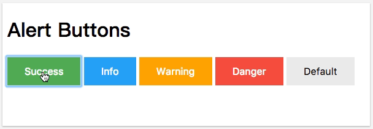

### Demo


[w3schools链接](https://www.w3schools.com/howto/howto_css_alert_buttons.asp)

### Bullet Points
* `button` 自带的 `border` 样式会影响自定义样式. 建议取消默认的 `broder` 样式.
* 将共性的样式放入一个类中, 提高重用.

### Code
```html
<!DOCTYPE html>
<html>
<head>
<style>

/* 类选择器, 选择属于.btn类的所有元素. */
.btn {
    border: none;
    color: white;
    padding: 14px 28px;
    font-size: 16px;
    cursor: pointer;
}

/* 类选择器, 选择属于success类的所有元素. */
.success {background-color: #4CAF50;}

/* :hover伪类, 鼠标悬停. 属于success类的所有元素的鼠标悬停状态 */
.success:hover {background-color: #46a049;}

.info {background-color: #2196F3;} /* Blue */
.info:hover {background: #0b7dda;}

.warning {background-color: #ff9800;} /* Orange */
.warning:hover {background: #e68a00;}

.danger {background-color: #f44336;} /* Red */ 
.danger:hover {background: #da190b;}

.default {background-color: #e7e7e7; color: black;} /* Gray */ 
.default:hover {background: #ddd;}
</style>
</head>
<body>

<h1>Alert Buttons</h1>

<button class="btn success">Success</button>
<button class="btn info">Info</button>
<button class="btn warning">Warning</button>
<button class="btn danger">Danger</button>
<button class="btn default">Default</button>

</body>
</html>

```