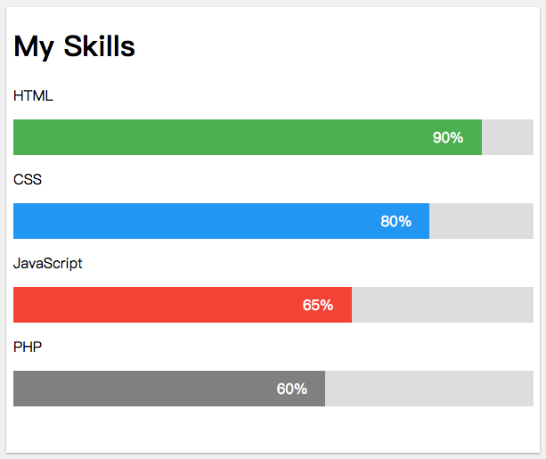
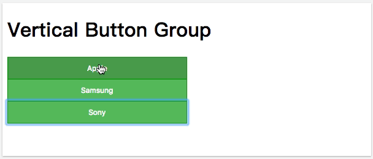
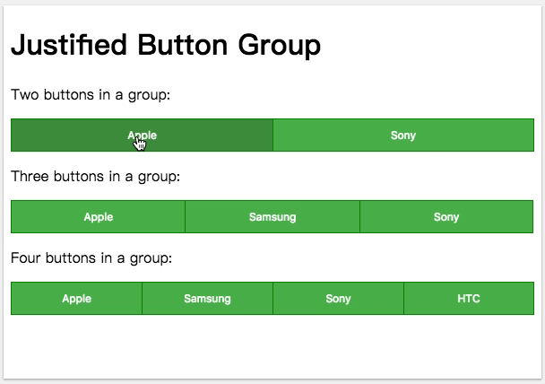

## 知识点

> * `box-sizing` 属性使用
> * `:not` `:last-child` 属性使用
> * `cursor` 属性使用
> * `width` 使用百分比值(父元素的宽度的百分比), 实现宽度动态变化

## 代码清单
* [CSS 盒模型](../Foundation/盒模型/README.md)
* [CSS box-sizing](https://developer.mozilla.org/zh-CN/docs/Web/CSS/box-sizing)
* [CSS cursor](https://developer.mozilla.org/zh-CN/docs/Web/CSS/cursor)
* [CSS :not](https://developer.mozilla.org/zh-CN/docs/Web/CSS/:not)
* [CSS :last-child](https://developer.mozilla.org/zh-CN/docs/Web/CSS/:last-child)

## Demo演示
  
[Skill Bar 代码清单](../HowTo/Skill_Bar/README.md)

 
[Button Group](../HowTo/Button_Group/README.md)

 
[Vertical Button Group 代码清单](../HowTo/Vertical_Button_Group/README.md)

 
[Justified Button Group](../HowTo/Justified_Button_Group/README.md)

## 限时代码
**Justified Button Group** 5分钟内完成.

