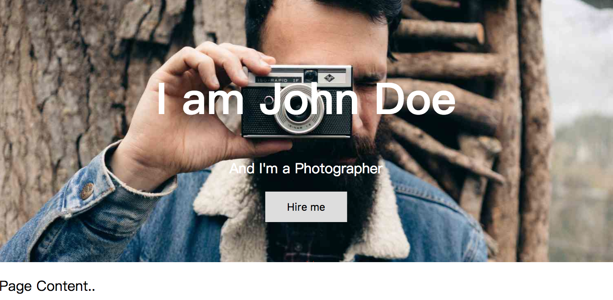
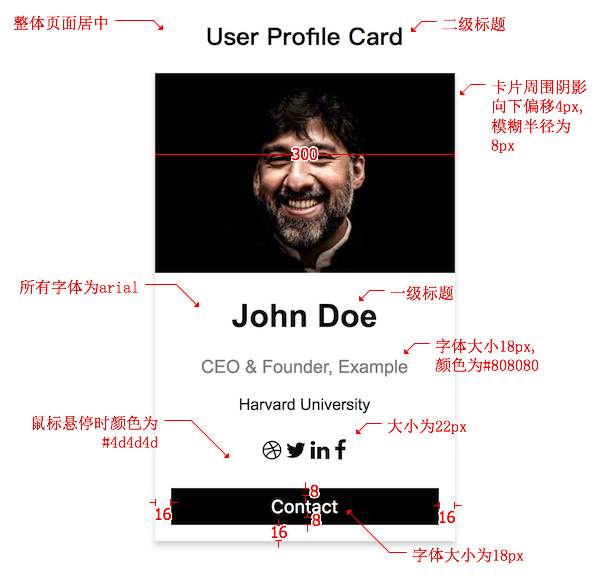

## 知识点

> * 各种居中效果实现
> * `box-shadow` 阴影的使用
> * `text-align` 文本居中
> * `transform` 属性
> * `font-family` 属性
> * `position` 定位属性

## 代码清单
* [Box Shadow](https://developer.mozilla.org/zh-CN/docs/Web/CSS/box-shadow)
* [Transform](https://developer.mozilla.org/zh-CN/docs/Web/CSS/transform)
* [Font-family](https://developer.mozilla.org/zh-CN/docs/Web/CSS/font-family)
* [CSS Position](http://w3schools.bootcss.com/css/css_positioning.html)
* [CSS Layout - Horizontal Align](http://w3schools.bootcss.com/css/css_align.html)

## Demo演示
  
[Hero Image 代码清单](../HowTo/Hero_Image)

  
[Profile Card 代码清单](../HowTo/Profile_Card)

## 限时代码
**Hero Image** 5分钟内完成

