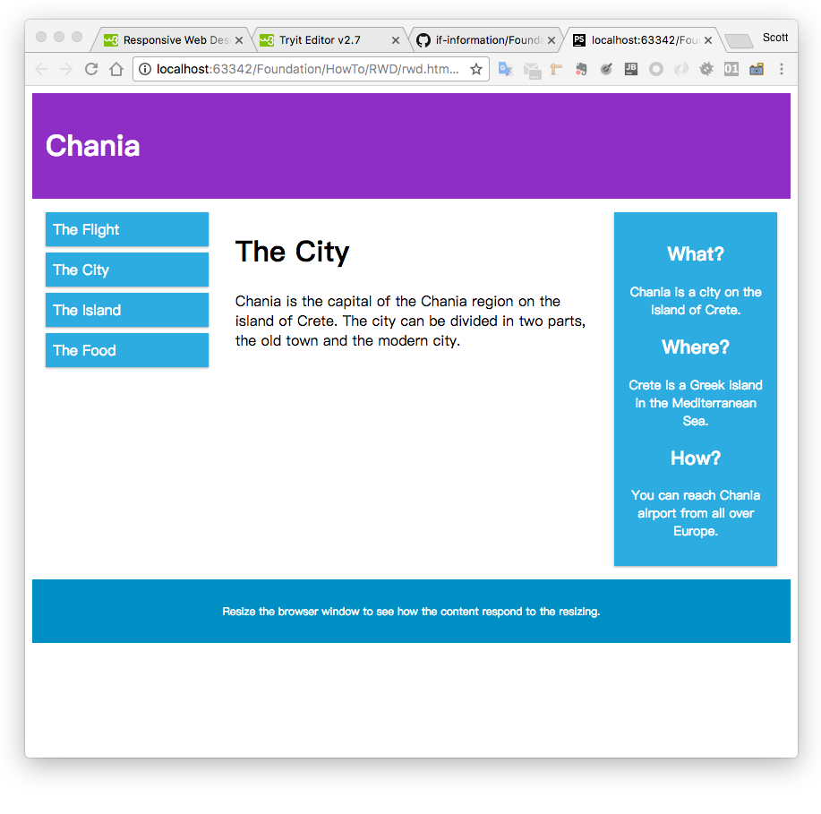
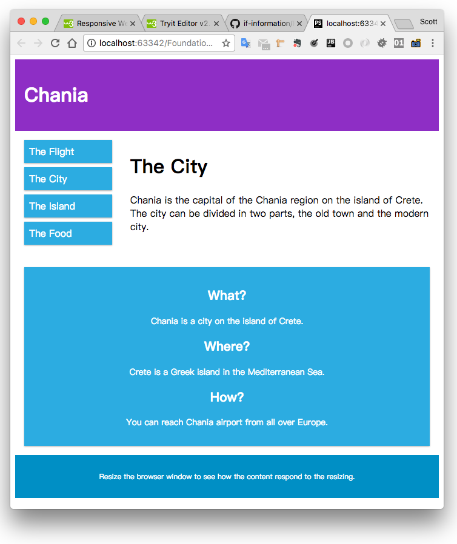
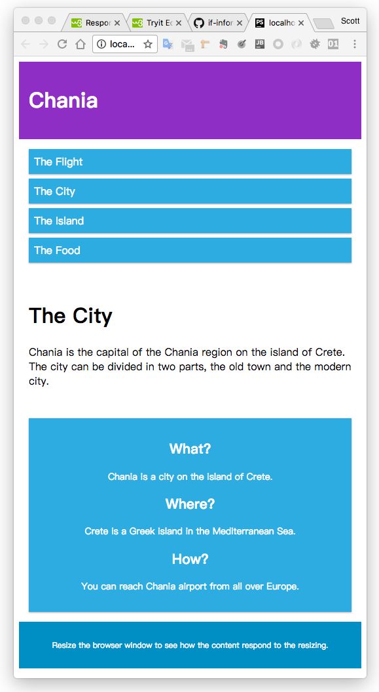

## 知识点
> * `viewport`
> * `@media` 
> * 通过 `@media` 和 `viewport` 实现响应式布局
> * `box-sizing` 使用
> * 属性选择器的使用
> * Grid 布局

## 代码清单
* [RWD Introduction](http://w3schools.bootcss.com/css/css_rwd_intro.html)
* [RWD Viewport](http://w3schools.bootcss.com/css/css_rwd_viewport.html)
* [RWD Grid-View](http://w3schools.bootcss.com/css/css_rwd_grid.html)
* [RWD Media Queries](http://w3schools.bootcss.com/css/css_rwd_mediaqueries.html)
* [RWD Images](http://w3schools.bootcss.com/css/css_rwd_images.html)

## 演示Demo

[Demo 代码清单](../HowTo/RWD)

## 限时代码
Demo代码15分钟内完成

