## 京东水果Demo

### 页面效果

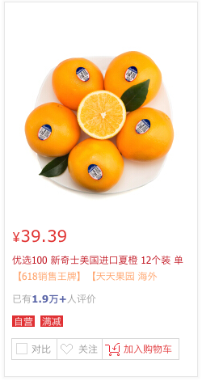

### 需求描述

* 默认字体大小为12px, 行高为150%. 
* 默认字体为无衬线字体: tahoma,arial,Microsoft YaHei,Hiragino Sans GB
* 鼠标悬停时显示的文本为: 【618销售王牌】【天天果园 海外直采】【新奇士品牌】【感恩返场】橙风破浪，酸甜多汁，维C满满！搭配优质新西兰柠檬，营养更佳，美美哒！

* 链接文本为: 
    * 优选100 新奇士美国进口夏橙 12个装 单果重约140-200g 新鲜水果
    
    * 【618销售王牌】【天天果园 海外直采】【新奇士品牌】【感恩返场】橙风破浪，酸甜多汁，维C满满！搭配优质新西兰柠檬，营养更佳，美美哒！
    * 文本超出部分隐藏
    

### 素材
涉及的图片在images文件中.

### 设计图
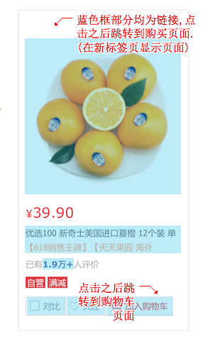
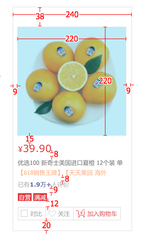
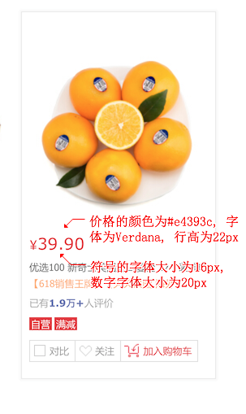
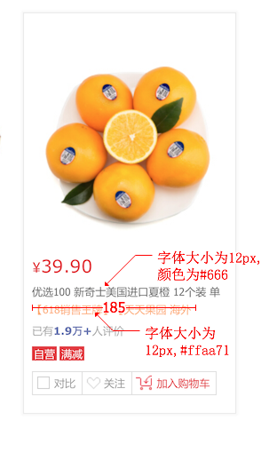
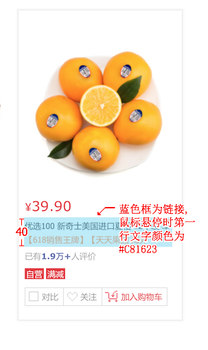
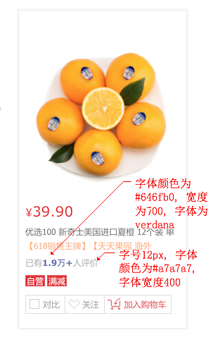
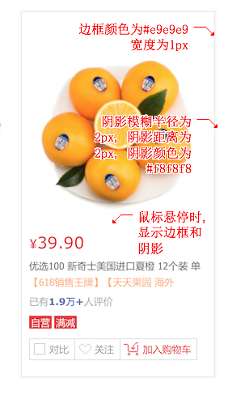
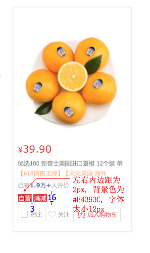
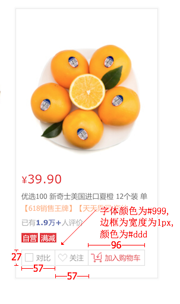
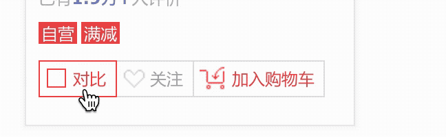
