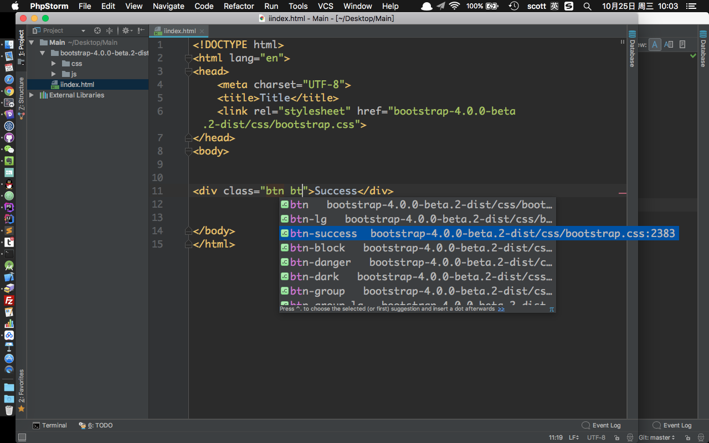

## 知识点

> * 了解BootStrap框架
> * 在项目中如何导入BootStrap框架
> * BootStrap的Grip系统

### 项目中导入本地BootStrap框架

在 [BootStrap 官方网站](http://getbootstrap.com/) 下载BootStrap框架到本地. 

将BootStrap框架拷贝到项目中, 在 `<link>` 标签中引入 `bootstrap.css` 文件

代码提示中会看到bootstrap的相关CSS类提示.

### 代码清单
* [Bootstrap Grid System](http://w3schools.bootcss.com/bootstrap/bootstrap_grid_system.html)
* [Bootstrap Grid: Stacked-to-horizontal](http://w3schools.bootcss.com/bootstrap/bootstrap_grid_stacked_to_horizontal.html)
* [Bootstrap Grid - Small Devices](http://w3schools.bootcss.com/bootstrap/bootstrap_grid_small.html)
* [Bootstrap Grid - Medium Devices](http://w3schools.bootcss.com/bootstrap/bootstrap_grid_medium.html)
* [Bootstrap Grid - Large Devices](http://w3schools.bootcss.com/bootstrap/bootstrap_grid_large.html)
* [Bootstrap Grid Examples](http://w3schools.bootcss.com/bootstrap/bootstrap_grid_examples.html)
* [Bootstrap Tables](http://w3schools.bootcss.com/bootstrap/bootstrap_tables.html)
* [Bootstrap Alerts](http://w3schools.bootcss.com/bootstrap/bootstrap_alerts.html)
* [Bootstrap Buttons](http://w3schools.bootcss.com/bootstrap/bootstrap_buttons.html)
* [Bootstrap Navigation Bar](http://w3schools.bootcss.com/bootstrap/bootstrap_navbar.html)

 

 