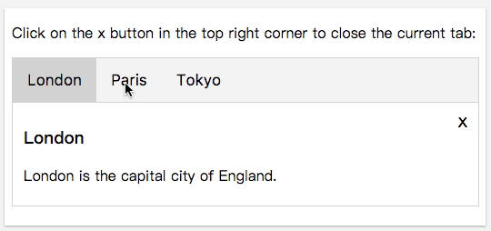

## 知识点
> * `Element.className`
> * `String.prototype.replace()`
> * JavaScript的事件 `Event`
> * JavaScript事件监听 `EventListener`

## 代码清单
* [JS Event](http://w3schools.bootcss.com/js/js_htmldom_events.html)
* [JS EventListener](http://w3schools.bootcss.com/js/js_htmldom_eventlistener.html)

## 演示Demo

[代码清单](../HowTo/Tabs)

